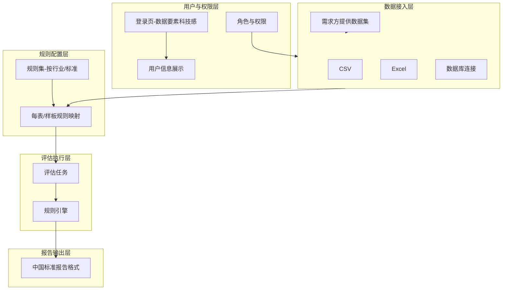

# 数据质量评估平台 - 中国标准整体升级改造计划

**版本**：V1.1  
**日期**：2025-03  
**更新日期**：2025-03  
**目标**：从系统功能与视角出发，综合设计符合中国数据质量评估规范的整体升级方案  
**实现进展**：阶段二（用户与权限）、部分阶段一（报告格式）已实现  

---

## 一、需求与现状分析

### 1.1 核心需求梳理

| 序号 | 需求描述 | 现状 | 目标 |
|------|----------|------|------|
| 1 | **业务普适性** | 示例数据多为演示场景 | 支持任意业务场景下的数据质量评估 |
| 2 | **评估流程** | 单一规则集应用于多数据源 | ①需求方提供数据集（CSV/Excel/DB）②为每个数据表/样板**单独选择**评估规则 |
| 3 | **报告格式** | 简单 total/passed/failed | 符合**中国数据质量评估报告完整格式**（GB/T 36344、DCMM 等） |
| 4 | **用户与角色** | 单用户 admin/admin | 多角色、多用户管理，登录后展示用户信息 |
| 5 | **登录页** | 常规渐变背景 | 带**数据要素**元素的科技感设计 |

### 1.2 中国数据质量报告格式要求（GB/T 36344-2018 / DCMM）

依据 GB/T 36344-2018《信息技术 数据质量评价指标》及 DCMM 数据管理能力成熟度评估实践，规范报告应包含：

- **基本信息**：报告标题、编制时间、评估范围、评估对象、评价目的、依据标准
- **评价指标体系**：六大指标（规范性、完整性、准确性、一致性、时效性、可访问性）及权重
- **各数据表/字段权重与判定依据**
- **整体评价结论**：各维度详细信息、质量等级
- **问题统计分析**：违规项、违规行/列统计、典型样例
- **改进建议**：针对性整改建议
- **附录**：数据说明、规则明细、原始记录

### 1.3 当前系统能力（已实现）

- 数据源：CSV、Excel、PostgreSQL、MySQL ✅  
- 规则集：按行业/标准建模，支持多数据源 ✅  
- 任务：一次可关联多数据源 + 规则集 ✅  
- 报告：整体汇总 + 分源明细 + 中国标准报告格式（report_cn）✅  
- 用户：多用户、多角色（管理员/评估员/查看者），JWT 认证，登录后展示用户信息 ✅  
- 登录页：简洁卡片式（数据要素科技感设计待阶段三）  

---

## 二、整体架构升级设计

### 2.1 产品定位升级

```
现状：轻量级数据质量评估工具
目标：面向中国数据质量标准的通用业务数据质量评估平台

适用场景：数据流通、数据入湖、数据治理、监管报送、DCMM 评估支撑
```

### 2.2 功能架构（升级后）



### 2.3 数据流（评估流程）

```
1. 需求方提供数据集
   ├── 上传 CSV / Excel
   └── 配置数据库连接

2. 为每个数据表/样板选择规则
   ├── 数据表 A → 选择规则集 1（或自定义规则子集）
   ├── 数据表 B → 选择规则集 2
   └── 支持列级规则映射（列名不一致时）

3. 创建评估任务并执行
   └── 生成符合中国标准的整体评估报告
```

---

## 三、分模块升级方案

### 3.1 业务普适性

| 改造项 | 说明 |
|--------|------|
| 数据集元信息 | 支持业务场景标签（如：金融信贷、政务人口、电商订单），便于多业务复用 |
| 数据表/文件命名 | 支持中文名、业务含义说明，便于报告引用 |
| 规则集行业分类 | 已按行业/标准建模，扩展行业枚举（金融、政务、医疗、制造等） |

### 3.2 评估流程：每表/每样板独立规则选择

| 改造项 | 说明 |
|--------|------|
| **任务-数据源-规则映射** | 任务不再简单绑定「多数据源 + 1 规则集」，改为「每个数据源可单独指定规则集或规则子集」 |
| **数据结构** | `Task.datasource_rule_mappings: JSON`，形如：`[{"datasource_id":"xx","rule_set_id":"yy"}]` 或 `[{"datasource_id":"xx","rules":[...]}]` |
| **执行逻辑** | 遍历映射，按 (数据源, 规则) 执行，汇总后生成报告 |
| **前端** | 执行任务页：先选多数据源 → 为每个数据源配置规则（选择规则集或勾选规则） |

### 3.3 中国标准报告格式

| 模块 | 改造内容 |
|------|----------|
| **报告结构** | 按 GB/T 36344 / 行业实践，输出：封面、基本信息、评价指标体系、各表评价结论、问题统计、改进建议、附录 |
| **评价指标映射** | 规则类型 → 六大指标（规范性、完整性、准确性、一致性、时效性、可访问性），支持权重配置 |
| **质量等级** | 输出整体/分表质量等级（如：优/良/中/差），可配置阈值 |
| **HTML/PDF 报告** | 使用正式报告模板（页眉页脚、目录、图表、表格），支持导出 PDF |
| **JSON 结构** | 扩展 `report` 结构，包含 `meta`、`indicators`、`tables`、`problems`、`suggestions` 等节点 |

### 3.4 用户、角色与权限

| 改造项 | 说明 |
|--------|------|
| **用户表** | 扩展或新建：`id`、`username`、`password_hash`、`real_name`、`email`、`org`、`role_id`、`created_at` |
| **角色表** | `id`、`name`（管理员/评估员/查看者）、`permissions`（JSON 或关联表） |
| **权限** | 数据源管理、规则集管理、任务执行、报告查看、用户管理、系统设置（可配置） |
| **登录返回** | 除 token 外返回 `user_info`：姓名、角色、机构、头像等 |
| **Layout 展示** | 侧边栏顶部/底部显示当前用户信息（姓名、角色、机构） |

### 3.5 登录页：数据要素科技感

| 设计方向 | 说明 |
|----------|------|
| **视觉元素** | 数据流动动画、节点/连线、数据立方体、要素图标（如：数据交易、数据资产） |
| **配色** | 深色科技风（深蓝/深灰）+ 数据绿/蓝高光；或浅色 + 渐变数据流 |
| **动效** | 背景粒子/网格、数据流线条动画、登录框微动效 |
| **文案** | 突出「数据要素」「数据质量」「数据治理」等关键词 |
| **参考** | 数据交易所、数据资产管理平台类产品的登录页风格 |

---

## 四、实施阶段与优先级

### 阶段一：评估流程与报告（P0）— 进行中

- 任务-数据源-规则映射（每表独立选规则）— 规划中
- 报告格式升级（中国标准结构）✅ 已实现（report_cn 模块）
- 报告 HTML/PDF 导出 ✅ 已支持

### 阶段二：用户与权限（P0）✅ 已实现

- 用户表、角色表、权限模型 ✅
- 登录返回用户信息 ✅
- Layout 展示用户信息 ✅
- 角色权限控制（管理员 / 普通用户）✅

### 阶段三：登录页与视觉升级（P1）

- 登录页数据要素科技感设计 — 规划中
- 整体 UI 风格统一（可选）

### 阶段四：业务普适性与增强（P2）

- 数据集业务场景标签 — 规划中
- 行业规则集扩展 — 规划中
- 质量等级与权重配置 — 规划中

---

## 五、关键技术要点

### 5.1 数据模型变更

```
Task:
  - datasource_ids → 保留或弃用
  - datasource_rule_mappings: JSON  # 新增，每数据源对应规则

Report (AssessmentResult):
  - 扩展 summary/details 结构，增加 meta/indicators/tables/problems/suggestions
  - 支持多格式输出（HTML 标准模板、PDF）
```

### 5.2 报告模板

- 使用 Jinja2 或 Vue 组件生成报告页面
- 支持 Word/PDF 导出（python-docx、weasyprint 或前端打印 PDF）

### 5.3 安全

- 密码使用 bcrypt/argon2 存储
- JWT 或 session 管理
- 角色权限中间件/装饰器

---

## 六、交付物与验收

| 阶段 | 交付物 | 验收标准 | 状态 |
|------|--------|----------|------|
| 阶段一 | 每表规则映射功能、中国标准报告格式 | 可为不同数据表配置不同规则，报告符合 GB/T 36344 结构 | 报告格式 ✅，规则映射规划中 |
| 阶段二 | 用户角色管理、登录用户信息展示 | 支持多用户登录，Layout 显示用户信息 | ✅ 已完成 |
| 阶段三 | 登录页改版 | 具备数据要素科技感，视觉与文案符合要求 | 规划中 |
| 阶段四 | 业务标签、行业扩展 | 可标注业务场景，规则集按行业筛选 | 规划中 |

---

## 七、附录：中国数据质量评价指标对照

| GB/T 36344 指标 | 当前规则类型映射 |
|-----------------|------------------|
| 规范性 | data_type, validity_regex_match_check |
| 完整性 | completeness |
| 准确性 | accuracy_range_check, uniqueness |
| 一致性 | consistency_date_order_check |
| 时效性 | timeliness_fixed_range_check |
| 可访问性 | （需扩展：连接可用性、权限等） |
